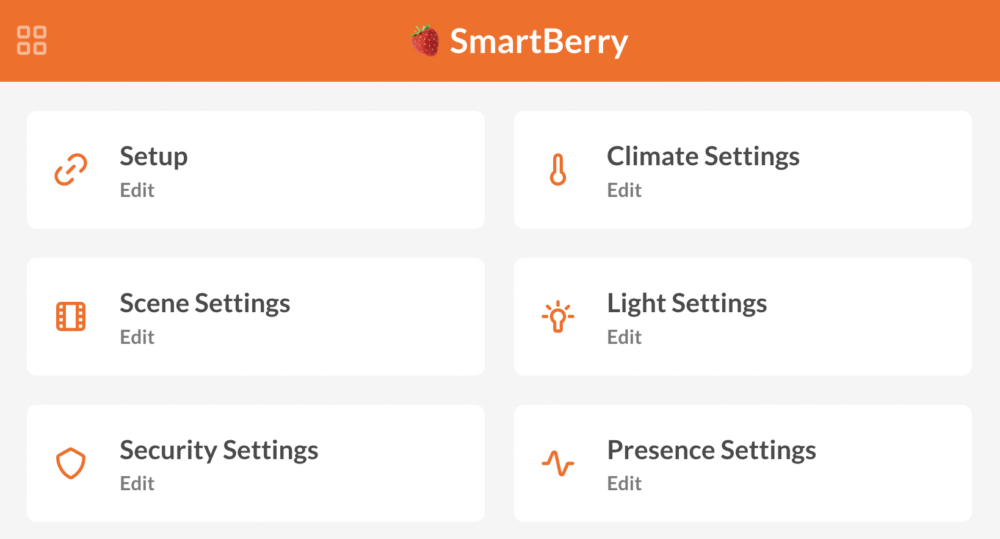

# 
SmartBerry 🍓 - Smart Home 🏡

_
SmartBerry is an openHAB environment providing multiple extensions to simplify the configuration of scenes, climate and security management.
_

## Features

Make use of the following features:

- Easily manage your lights 💡
  - Trigger lights by light conditions
  - Auto-on lights on presence
  - Make use of light scenes
  - Simulate lights when away
  - Easy location-dependant configuration
  - Welcome light feature
- Heating Management 🔥
  - Different heating configurations for sleep, home and away states
  - Turn off all radiators automatically on open windows
- Presence Management 👋
  - Update your presence automatically
  - Apply your presence state to security, light, heating and scene configurations
- Scene Management 🎬
  - Change items in a location with a single trigger
  - Any item can be added to custom scenes
  - Trigger scenes automatically
- Security Features 🔒
  - Smoke and assault detection
  - Supports alarm and siren items
  - Close lock items automatically by window or door sensors

All features are easily configurable without using a single line of code! SmartBerry comes with an additonal configuration dashboard.

## Getting Started

It is recommend to use SmartBerry in a docker container using `docker compose`. The easiest way to do so, is a deployment of SmartBerry via [balenaCloud](https://www.balena.io/cloud/). Just add the project to your balena applications and select a supported device. You also like to change the hostname of your device to `smartberry` - to do so, study these [notes](https://www.balena.io/docs/learn/develop/runtime/#change-the-device-hostname).

In order to adjust general settings of your SmartBerry instance, you may add the following environment variables.

| Environment variable               | Description                                                                                                                                                                                           |
| :--------------------------------- | :---------------------------------------------------------------------------------------------------------------------------------------------------------------------------------------------------- |
| `SAMBA_PASSWORD` (mandatory)       | Define the default password in order to access `smb://smartberry`                                                                                                                                     |
| `OPENHAB_HOSTKEY` (recommended)    | Set the hostkey to keep the device in the _known_ host on your computer.                                                                                                                              |
| `OPENHAB_UUID` (recommended)       | Set your openhab uuid for [`myopenhab.org`cloud service](https://myopenhab.org/).                                                                                                                     |
| `OPENHAB_SECRET` (recommended)     | Set your openhab secret for [`myopenhab.org`cloud service](https://myopenhab.org/).                                                                                                                   |
| `JWT_SECRET` (recommended)         | Set a secret to salt your connection of openhab-helper.                                                                                                                                               |
| `BLUETOOTH_BEACON_UUID` (optional) | For locks or smartphone apps it may be useful for you to work with [iBeacons](https://de.wikipedia.org/wiki/IBeacon). If supported by your hardware, you can define a constant bluetooth beacon uuid. |

After starting up, SmartBerry is available on port `8080`. To make SmartBerry manage your home in its full potential, access the helper application on port `8081`. Please also refer to the documentation of [openHAB](https://www.openhab.org/docs/).

If you have any questions, join our [Discord server](https://discord.gg/xYypJZYYPY) or just let us know in the _Issues_.
